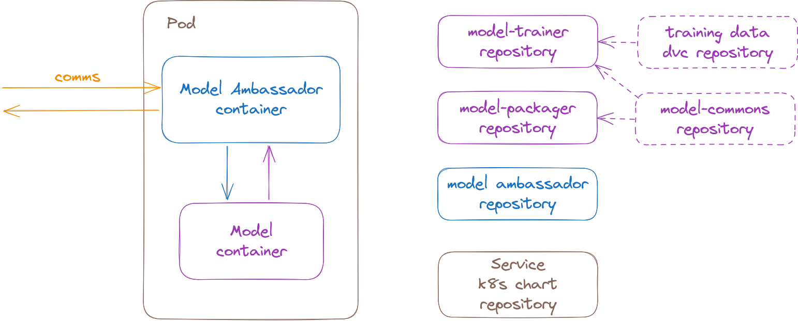
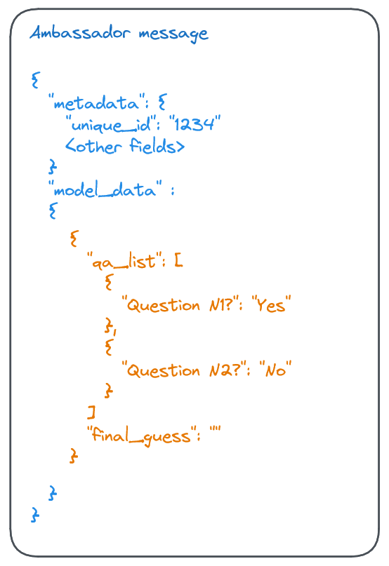
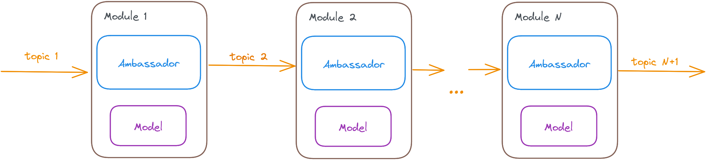

# Model Ambassador
A java spring service handling communications and security on behalf of the ML model hosted as a sidecar on the same pod.
The service to be seen as a part of the wider ecosystem within a Kubernetes-hosted organisation.

## Context

Recent surge in demand for hosting ML models challenged organisations to further evolve mindsets from SaaS (Software as a Service) to MaaS (Model as a service).
The common problems technical problems of hosting models include:
* Using Big-Tech tooling is expensive and outside of organisation's infrastructure setup
* Models are executed within some language (Python, C++, Java); it is hard to have both: flexibility of choice for ML frameworks and application security
* Enterprise-grade models require decay monitoring. For it to work, there is a need for input/output data export -- which becomes difficult to manage in uniform way when there are multiple models using variety of languages/frameworks.
The common practical team-level considerations revolves around cognitive load: it is close to impossible for a single role/person to solve well all aspects: infrastructure, security, comms SLOs and the ML model itself.

Therefore, the proposed solution is to clearly define responsibilities of each role in the team and to have a hosting architecture reflecting the above concerns.
Technically, model service is a double-container application. Externally facing container is written and maintained by Software Developers. 
That container accesses model-container on localhost via REST API, with the latter not being visible outside the pod and maintained by Data Scientists.
It allows to fit the model into the existing and familiar organisation's service mesh while providing data science with maximum technology flexibility and focus to solve the business problem.

Cross-skill team this way also has a clearly defined responsibilities.
Platform engineer is responsible for the IaC: kubernetes chart/templates, IAM, buckets/queues/databases needed for the model to run.
Software engineer is responsible for the externally facing side of the service -- how API fits into the service mesh, security, handling metadata for ML requests. The deployment of the software is simply an update of the model-ambassador container version in the chart.
Data Scientist is responsible for solving ML problem itself as well as the minimal adapter glue code for the model. Data Scientists can deploy the model frequently, as the deployment is simply an update of the model container version in the chart.
Note that roles are loosely coupled unlike in the embedded-model pattern (model binary being included as a resource directly into the externally-facing service).

## Overview
Model Ambassador application is the primary software layer of the service.
Its purpose is to allow secure, flexible and standardised integration of models into organisation's service mesh.
The application is written in [Hexagonal](https://medium.com/ssense-tech/hexagonal-architecture-there-are-always-two-sides-to-every-story-bc0780ed7d9c) architecture.

The **domain** logic for the ambassador is simply handling of the metadata while passing input data to the model and getting the output.
**Ports** wary and can include REST APIs, Kafka, SQS, PubSub among the others. We provide REST API here for simplicity.
**Adapters** are twofold: communicating with model and exporting model data. We skip the latter here, but it is a classical Data Warehouse/Lake export -- ranging from S3/Athena/Quicksight to Redshift/BigQuery etc, depending on your organisation's tech choices.
The former adapter we already mentioned to be a REST adapter on localhost, but there is a space for more efficient shared-memory/shared-drive communications on Kubernetes -- so we might need other adapters depending on the situation in the future.

## Ambassador and model chains
While for the Big Data solutions it is a common reasonable step to consider Spark/GCP Dataflow/AWS Glue kinds of hosting solutions of ETL pipelines,
quite often there is a small/middle step before that.

Ambassador pattern combined with queues, allows to naturally grow model-chains (such as ones needed for NLP problems). Naturally, software-only modules can be added, as well as the topology can be modified from a chain can be modified into DAG.
Queues allow us to navigate between the low volumes by scaling pods to 0 to high volumes -- with auto-scaling model-groups reacting to the queue pressure.
Therefore, the basic scalability is achieved while maintaining the simplicity for Data Scientists to do the work they are doing (without adding extra cost in requiring there implementations to take into account spark etc.).

