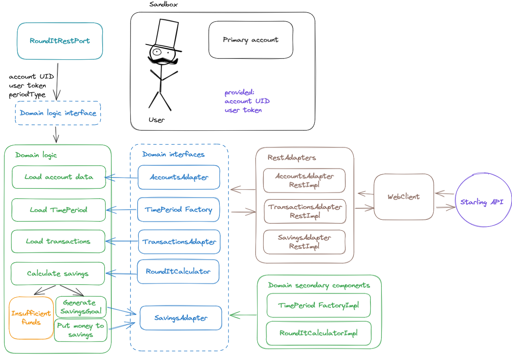
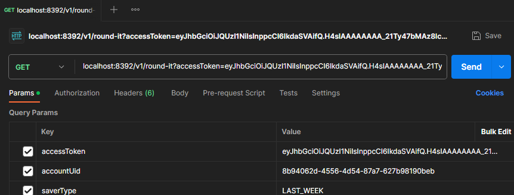
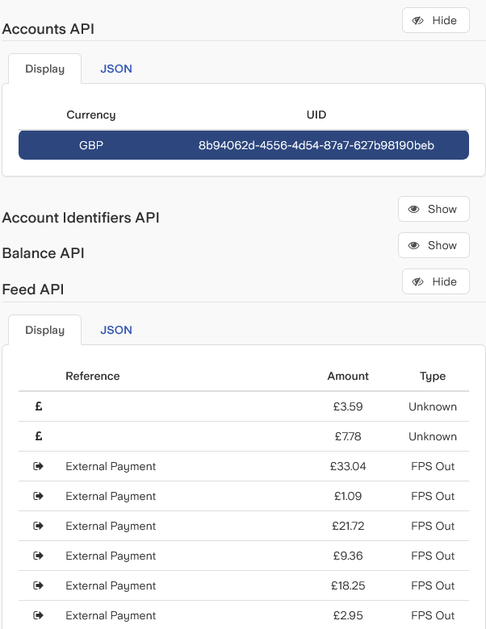

# RoundItAndSave [Elijah Hradovich]
A service helping clients to save money based on the rounding-up to pounds of their payments to be transferred to savings goal.

## Overview

The application is written in [Hexagonal](https://medium.com/ssense-tech/hexagonal-architecture-there-are-always-two-sides-to-every-story-bc0780ed7d9c) architecture.
The primary idea is to decouple *domain* logic from how it is going to be used/accessed. 
In our case, we would like **RoundItService** to calculate the rounding. We want it to be open to extension -- like
potentially it can be a part of a Kafka flow or some other event-driven bus.
This approach allows us to write domain logic without knowing details of APIs/Topics etc.

In short, the whole flow can be seen as follows:
* *Port* component triggers *RoundItService*
* *RoundItService* utilises adapters and domain helper components
* *Adapters* access Starling systems

Disclaimer 1: I haven't worked in banking, so some of the assumptions might be naive/incomplete 
(for example if instance fails in the middle of the execution,
there might be a saving goal created without any money transferred), so please don't judge too harshly.

Disclaimer 2: I haven't added any proper security handling for the access token, hope I understood the task description right that it's not expected.

## Domain
**RoundItServiceImpl** can be seen as the gateway to understand the core logic. The flow is as follows:
* Port provides *accessToken*, *accountUid*, *saverType* -- it is assumed that account type was already checked and that the saver type is LAST_WEEK for this task
* We load user **account** (validate input to be working, we need **currency** type from the output)
* Use domain helper to map *saverType* to timestamp range between min and max
* Load **FeedItems** for the calculated time period, adapter is expected to filter payments to be **OUT** only ones etc. (No validation for currency compatibility between the account and the feed yet)
* Get balance for the **account** and check if the balance is sufficient for savings transfer (I saw later in API description that there is a special endpoint for such checks, but I haven't had time to fix it)
* If balance is sufficient -- generate **savings goal** and add the calculated amount there; return that amount
* Return zero otherwise
* Adapters are expected to throw exception if anything goes wrong and the service re-throws it

## Port (running application)

Currently, the port is a rest api with GET endpoint, expecting three parameters to work as on the screenshot above.
It was easier to do with Spring then the command line application; I run out of time for proper WebMVCTest.

On the first run *OUT* transaction filter was not enabled, so the goal was not created correctly.
On the second run the filter was put into the adapter and the calculated value was correct.

## Adapters
Adapters use Spring's *WebClient* to call Starling API.
They rely on a separate set of entities which in this implementation simply implements domain data interfaces.
Please note that copying data across the layers is often a practice, skipped here for the sake of velocity.

Adapters were not optimised -- there is a space for WebClient helpers to handle *uri* strings, header-building,
house abstract function for handling API response status codes/do retries, have a timeout etc.

### Notes
I haven't completed all of the unit tests I wanted to. 
In practical workflow, I wouldn't add those Ports/Adapters without proper tests, but on local machine without code base as a reference things
take bit long to setup and run so I allowed myself a compromise.

My general approach was a TDD-ish domain creation first, to formulate the details of the picture in my head.
Then TDD-ish domain helper creation, then adapters and then the port.
